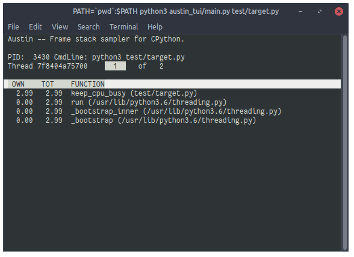
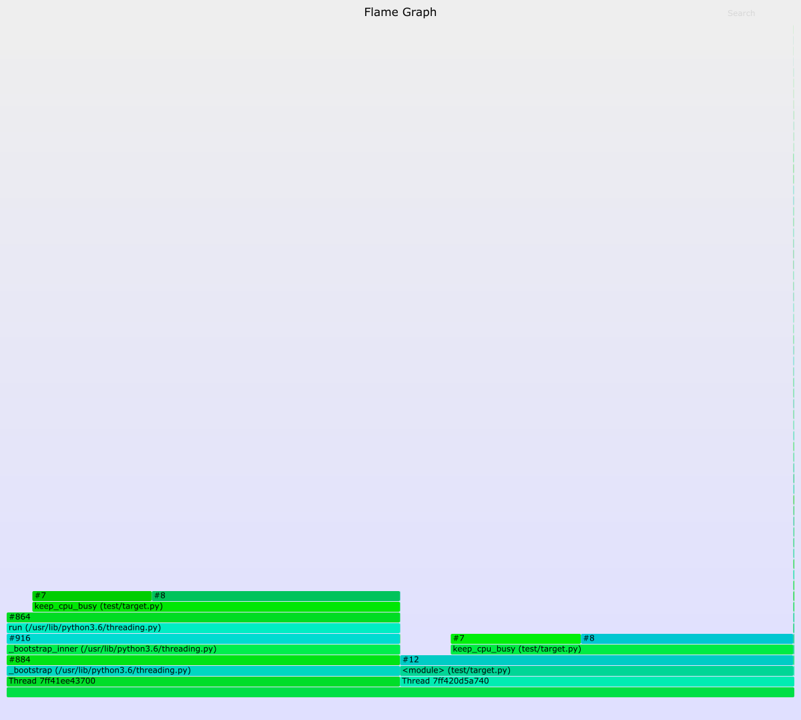

<h1 align="center">
   
  
   
</h1>

<h3 align="center">A Frame Stack Sampler for CPython</h3>

  
  
  
  

  
  &nbsp;&nbsp;&nbsp;&nbsp;
  
  &nbsp;&nbsp;&nbsp;&nbsp;
  

  <a href="#synopsis"><b>Synopsis</b></a>&nbsp;&bull;
  <a href="#installation"><b>Installation</b></a>&nbsp;&bull;
  <a href="#usage"><b>Usage</b></a>&nbsp;&bull;
  <a href="#compatibility"><b>Compatibility</b></a>&nbsp;&bull;
  <a href="#why--austin"><b>Why  Austin</b></a>&nbsp;&bull;
  <a href="#examples"><b>Examples</b></a>

<!--

<h3 align="center">A frame stack sampler for CPython</h3>

  

-->

# Synopsis

Austin is a Python frame stack sampler for CPython written in pure C. It samples
the stack traces of a Python application so that they can be visualised and
analysed. As such, it serves the basis for building powerful profilers for
Python.

The most interesting use of Austin is probably in conjunction with FlameGraph to
profile Python applications while they are running, without the need of
instrumentation. This means that Austin can be used on production code with
little or even no impact on performance.

However, the output format can be grabbed from any other external tool for
further processing. Look, for instance, at the following Python TUI, similar in
spirit to [py-spy](https://github.com/benfred/py-spy).

<!--  -->

The current version only supports Python on Linux-based operating systems that
have not been compiled with the `--enable-shared` flag. Support for other
operating systems is next in line.

> **NOTE** The TUI is experimental and still work in progress. Its main purpose
> is to provide an example of how to use the output produce by Austin rather
> than an additional application to maintain.

# Installation

Austin can be installed using `autotools` or as a snap from the Snap Store. The
latter will automatically perform the steps of the `autotools` method with a
single command

## With `autotools`

Installing Austin using `autotools` amounts to the usual `./configure`, `make`
and `make install` finger gymnastic. The only dependency is the standard C
library.

~~~ bash
git clone --depth=1 https://github.com/P403n1x87/austin.git
autoreconf --install
./configure
make
make install
~~~

Compilation has been tested with GNU GCC 7.3.0 on Linux, MinGW 2.28-1 on Windows
and LLVM 8.0.0 with clang-800.0.42.1. The code is so simple that it really
compiles with just

~~~ bash
gcc -O3 -Wall src/*.c -o src/austin
~~~

so you can use just this command if you don't have `autoreconf` installed.

Add `-DDEBUG` if you want a more verbose syslog output on UNIX-like systems,
or `%TEMP%/austin.log` on Windows.

## From the Snap Store

Austin can be installed from the Snap Store with the following command

~~~ bash
sudo snap install austin --channel=beta
~~~

Note that this will fetch the latest sources from the `master` branch on
GitHub and invoke the `autotools` steps.

# Usage

~~~
Usage: austin [OPTION...] command [ARG...]
Austin -- A frame stack sampler for Python.

  -a, --alt-format           alternative collapsed stack sample format.
  -e, --exclude-empty        do not output samples of threads with no frame
                             stacks.
  -i, --interval=n_us        Sampling interval (default is 500us).
  -p, --pid=PID              The the ID of the process to which Austin should
                             attach.
  -s, --sleepless            suppress idle samples.
  -t, --timeout=n_ms         Approximate start up wait time. Increase on slow
                             machines (default is 100ms).
  -?, --help                 Give this help list
      --usage                Give a short usage message
  -V, --version              Print program version

Mandatory or optional arguments to long options are also mandatory or optional
for any corresponding short options.
~~~

The output is a sequence of frame stack samples, one on each line. The format is
the collapsed one that is recognised by
[FlameGraph](https://github.com/brendangregg/FlameGraph) so that it can be piped
to `flamegraph.pl` in order to produce flame graphs, or redirected to a file for
some further processing.

Each line has the structure

~~~
Thread [tid];[func] ([mod]);#[line no];[func] ...;L[line no] [usec]
~~~

The reason why the line number is not included in the `([mod])` part, as done
by py-spy, is that, this way, the flame graph will show the total time spent at
each function, plus the finer detail of the time spent on each line. A drawback
of this format is that frame stacks double in height. If you prefer something
more conventional, you can use the `-a` option to switch to the alternative
format

~~~
Thread [tid];[func] ([mod]:[line no]);#[line no];[func] ... ([mod]:[line no]) [usec]
~~~

Austin uses syslog for log messages so make sure you watch `/var/log/syslog` for
the `austin` tag to get execution details and statistics. _Bad_ frames are
output together with the other frames. In general, entries for bad frames will
not be visible in a flame graph as all tests show error rates below 1% on
average.

# Compatibility

Austin has been tested on the following systems (both 32- and 64-bit, unless
otherwise specified).

> **NOTE** Austin *might* work with other versions of Python on all the
> platforms and architectures above. So it is worth giving it a try even if
> your system is not listed below.

##  Linux

- Python 2.3 (2.3.7) on Ubuntu 18.04.1
- Python 2.4 (2.4.6) on Ubuntu 18.04.1
- Python 2.5 (2.5.6) on Ubuntu 18.04.1
- Python 2.6 (2.6.9) on Ubuntu 18.04.1
- Python 2.7 (2.7.15rc1) on Ubuntu 18.04.1

- Python 3.3 (3.3.7) on Ubuntu 18.04.1
- Python 3.4 (3.4.9+) on Ubuntu 18.04.1
- Python 3.5 (3.5.2) on Ubuntu 18.04.1
- Python 3.6 (3.6.5, 3.6.6) on Ubuntu 18.04.1
- Python 3.7 (3.7.0, 3.7.1) on Ubuntu 18.04.1

##  Mac OS

- Python 2.7 (2.7.10) on OS X "El Capitan" 10.11.4

- Python 3.7 (3.7.0) on OS X "El Capitan" 10.11.4

> Due to the introduction of the System Integrity Protection, Austin
> cannot be used to profile Python applications that run using binaries located
> in system folders. The simplest solution is to create a virtual environment
> and use the local Python binaries instead.

##  Windows

- Python 2.7 (2.7.13) on windows 10 64-bit

- Python 3.6 (3.6.6) on Windows 10 64-bit
- Python 3.7 (3.7.0) on Windows 10 64-bit

- Python 3.6 (3.6.5, 3.6.6) on Ubuntu 18.04 x86-64 via WSL

# Why  Austin

When there already are similar tools out there, it's normal to wonder why one
should be interested in yet another one. So here is a list of features that
currently distinguish Austin.

- **Written in pure C** Austin is written in pure C code. There are no
  dependencies on third-party libraries with the exception of the standard C
  library and the API provided by the Operating System.

- **Just a sampler** Austin is just a frame stack sampler. It looks into a
  running Python application at regular intervals of time and dumps whatever
  frame stack it finds. The samples can then be analysed at a later time so that
  Austin can sample at rates higher than other non-C alternative that also
  analyse the samples as they run.

- **Simple output, powerful tools** Austin uses the collapsed stack format of
  FlameGraph that is easy to parse. You can then go and build your own tool to
  analyse Austin's output. You could even make a _player_ that replays the
  application execution in slow motion, so that you can see what has happened in
  temporal order.

- **Small size** Austin compiles to a single binary executable of just a bunch
of KB.

- **Easy to maintain** Occasionally, the Python C API changes and Austin will
need to be adjusted to new releases. However, given that Austin, like CPython,
is written in C, implementing the new changes is rather straight-forward.

<!-- TODO: These notes are slightly outdated

# A Note on How Austin Works

To understand how Python works internally in terms of keeping track of all the
function calls, you can have a look at similar projects like
[py-spy](https://github.com/benfred/py-spy) and follow the references therein
(in particular the [pyflame](https://github.com/uber/pyflame) project).

The approach taken by Austin is similar to py-spy in the sense that it too
peeks at the process memory while it is running, instead of pausing it with
`ptrace`.

Austin forks itself and executes the program specified at the command line. It
waits until python has mapped its memory and uses the information contained in
`/proc/[pid]/maps` to retrieve the location of the binary. It then looks at its
header in memory to find the location and size of the section header table and
maps the executable in memory.

The next thing that we need is the Python version, which is contained in the
`.rodata` section. It is located somewhere at the beginning of it, but since we
don't know exactly where, we scan for a string that looks like a Python version.
Based on the result we determine how to proceed, as the next step are, in
general, dependant on the Python release (due to changes in the ABI that can
happen even across different minor versions). For the time being, only version
3.6 is supported.

In order to get to the interpreter state, we can choose between two approaches.
One is to scan the `.bss` section multiple times until we find a pointer to the
heap that points to an instance of `PyInterpreterState`. To determine whether it
is a valid pointer or not we can use the relation between `PyInterpreterState`
and the `PyThreadState` it points to with the `tstate_head` field. Indeed, the
`PyThreadState` instance has a field, `interp`, that points back to the
`PyInterpreterState` instance. So, if we find this cyclic reference, we can be
quite certain that we have found the `PyInterpreterState` instance that we were
looking for.

Another approach is to look for the `_PyThreadState_Current` symbol in the
`.dynsym` section, which is just a pointer to an instance of `PyThreadState`,
and watch its de-referenced value until it points to a valid
`PyInterpreterState` instance. For the check we can use the same criterion as
before, bearing in mind that, in principle, the `tstate_head` of
`PyInterpreterState` can point to some other instance of `PyThreadState`.

At this point we are ready to navigate all the threads and traverse their frame
stacks at regular interval of times to sample them.

Starting with Python 3.7, the symbol `_PyRuntime` is exposed in the `.dynsym`
section. This is a pointer to an internal structure of type `_PyRuntimeState`.
The sub-field `interpreters.head` points to the head `PyInterpreterState`
instance that can then be de-referenced directly.

## Concurrency

Since the python process being sampled is not stopped, but a snapshot of its
threads and frame stacks is taken on the fly, some samples might end up being
invalid. Given that the Austin is written in pure C, it is bound to outperform
the Python process and give statistically reliable result at high sampling
rates.

Plans for the future involve the development of a hybrid mode that would allow
Austin to determine whether it is the case to pause the Python process in case
of a high invalid rate. Such a mode should be implemented judiciously, as even
when pausing the Python process there is no guarantee that one can read a valid
interpreter state. For example, it can easily happen that Austin decides to
pause the Python process while CPython is in the middle of updating the frame
stack. In this case, we would still read some potentially invalid or stale
memory references. A solution is to step over a few instructions and try again,
but even this approach doesn't guarantee 100% accuracy. It might be that a new
read now succeeds, but there is no way of telling whether the references are
genuine or not.

-->

# Examples

The following flame graph has been obtained with the command

~~~
./austin -i 50 ./test.py | ./flamegraph.pl --countname=us > test.svg
~~~

where the sample `test.py` script has the following content

~~~ python
import psutil

for i in range(1000):
  list(psutil.process_iter())
~~~

<!--  -->

The tall stack on the left is the initialisation phase of the Python
interpreter.

The Python TUI that is currently included in this repository is experimental and
work in progress. It serves the purpose of providing an example of how to use
Austin to profile Python applications. Here is a recording of the TUI in action
with a sample script that spawns a new thread and keeps the CPU busy with a CPU
bound loop on each thread. You can use `PageUp` and `PageDown` to navigate the
frame stack of each frame as the Python application runs.

If you want to use it you will have to make sure that all the dependencies
(`psutil` in this case) are installed, as the TUI project still lacks a
`setup.py` script.

~~~ bash
pip install psutil
~~~

> The TUI is based on `python-curses`. The version included with the standard
> Windows installations of Python is broken so it won't work out of the box. A
> solution is to install the the wheel of the port to Windows from
> [this](https://www.lfd.uci.edu/~gohlke/pythonlibs/#curses) page. Wheel files
> can be installed directly with `pip`, as described in the
> [linked](https://pip.pypa.io/en/latest/user_guide/#installing-from-wheels)
> page.

<!--  -->

----

# License

GNU GPLv3
