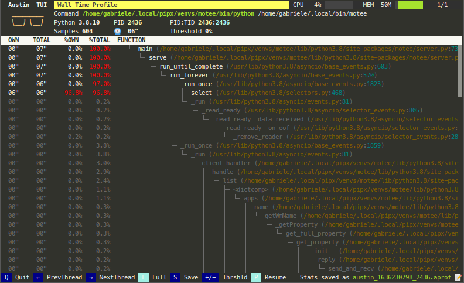
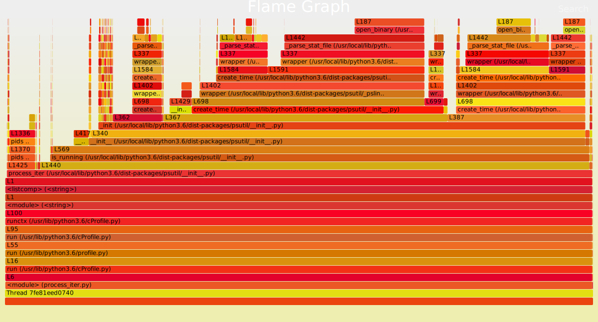
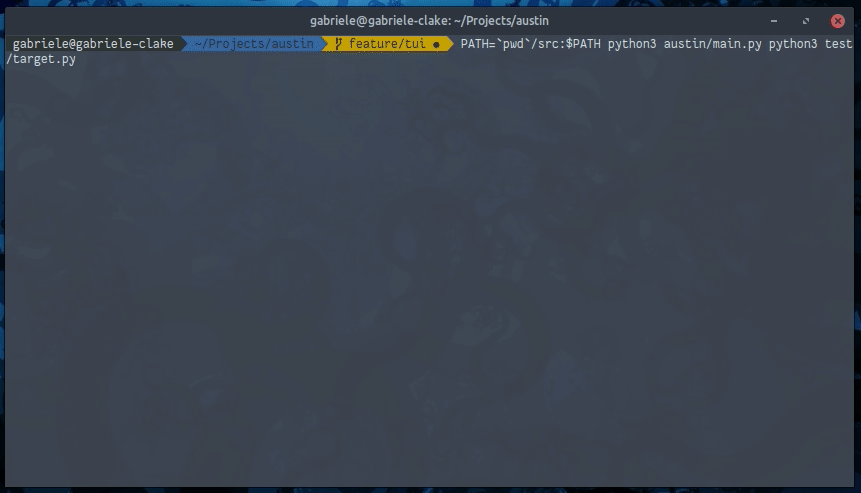
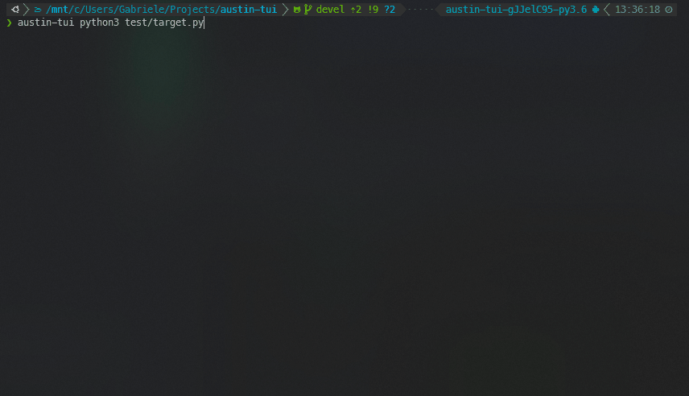
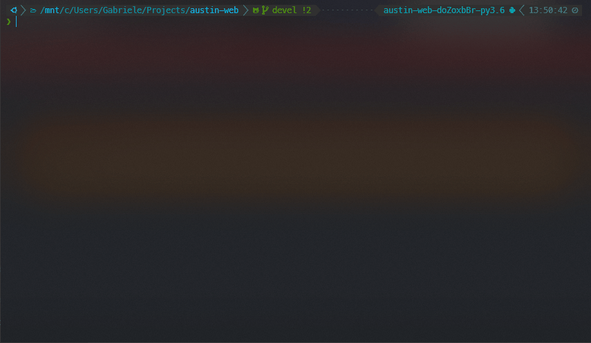
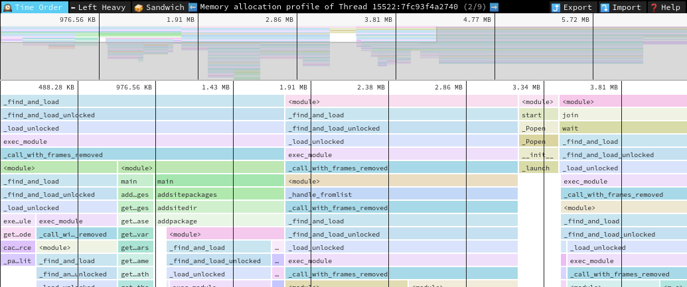

<h3 align="center">A Frame Stack Sampler for CPython</h3>

  
  &nbsp;&nbsp;&nbsp;&nbsp;
  
  &nbsp;&nbsp;&nbsp;&nbsp;
  

  
	
  </a>
  
	
  
  

  

  <a href="#synopsis"><b>Synopsis</b></a>&nbsp;&bull;
  <a href="#installation"><b>Installation</b></a>&nbsp;&bull;
  <a href="#usage"><b>Usage</b></a>&nbsp;&bull;
  <a href="#compatibility"><b>Compatibility</b></a>&nbsp;&bull;
  <a href="#why--austin"><b>Why  Austin</b></a>&nbsp;&bull;
  <a href="#examples"><b>Examples</b></a>&nbsp;&bull;
  <a href="#contribute"><b>Contribute</b></a>

  

----

<i>This is the nicest profiler I’ve found for Python. It’s
cross-platform, doesn’t need me to change the code that’s being profiled, and
its output can be piped directly into <code>flamegraph.pl</code>. I just used it
to pinpoint a gross misuse of SQLAlchemy at work that’s run in some code at the
end of each day, and now I can go home earlier.</i>  -- gthm on <a
href="https://lobste.rs/s/qairy5/austin_python_frame_stack_sampler_for">lobste.rs</a>

<i>If people are looking for a profiler, Austin looks pretty
cool. Check it out!</i>  -- Michael Kennedy on <a
href="https://www.youtube.com/watch?v=eFgybynhMrs">Python Bytes 180</a>

 <a href="https://twitter.com/AustinSampler">Follow  on </a>

----

# Synopsis

Austin is a Python frame stack sampler for CPython written in pure C. Samples
are collected by reading the CPython interpreter virtual memory space in
order to retrieve information about the currently running threads along with
the stack of the frames that are being executed. Hence, one can use Austin to
easily make powerful statistical profilers that have minimal impact on the
target application and that don't require any instrumentation.

The key features of Austin are:
- Zero instrumentation;
- Minimal impact;
- Fast and lightweight;
- Time and memory profiling;
- Built-in support for multi-process applications (e.g. `mod_wsgi`).

The simplest way to turn Austin into a full-fledged profiler is to combine it
with [FlameGraph](https://github.com/brendangregg/FlameGraph). However, Austin's
simple output format can be piped into any other external or custom tool for
further processing. Look, for instance, at the following Python TUI

  

Keep reading for more tools ideas and examples!

# Installation

Austin is available from the major software repositories of the most popular
platforms.

On Linux, it can be installed using `autotools` or as a snap from the [Snap
Store](https://snapcraft.io/store). The latter will automatically perform the
steps of the `autotools` method with a single command. On distributions derived
from Debian, Austin can be installed from the official repositories with
Aptitude.

On Windows, Austin can be easily installed from the command line using either
[Chocolatey](https://chocolatey.org/) or [Scoop](https://scoop.sh/)

On macOS, Austin can be easily installed from the command line using
[homebrew](https://formulae.brew.sh/formula/austin).

For any other platform, compiling Austin from sources is as easy as cloning the
repository and running the C compiler.

## With `autotools`

Installing Austin using `autotools` amounts to the usual `./configure`, `make`
and `make install` finger gymnastic. The only dependency is the standard C
library.

~~~ bash
git clone --depth=1 https://github.com/P403n1x87/austin.git
autoreconf --install
./configure
make
make install
~~~

Alternatively, sources can be compiled with just a C compiler (see below).

## From the Snap Store

Austin can be installed on [many major Linux
distributions](https://snapcraft.io/docs/installing-snapd) from the Snap Store
with the following command

~~~ bash
sudo snap install austin --classic
~~~

## On Debian and Derivatives

On March 30 2019 Austin was accepted into the official Debian
repositories and can therefore be installed with the `apt` utility.

## On macOS

Austin can be installed on macOS using [homebrew](https://docs.brew.sh):

~~~bash
brew install austin
~~~

## From Chocolatey

To install [Austin from Chocolatey](https://chocolatey.org/packages/austin), run
the following command from the command line or from PowerShell

~~~ shell
choco install austin
~~~

To upgrade run the following command from the command line or from PowerShell:

~~~ shell
choco upgrade austin
~~~

## From Scoop

To install Austin using Scoop, run the following command from the command line
or from PowerShell

~~~ shell
scoop install austin
~~~

To upgrade run the following command from the command line or from PowerShell:

~~~ shell
scoop update
~~~

## From Sources without `autotools`

To install Austin from sources using the GNU C compiler, without `autotools`,
clone the repository with

~~~ bash
git clone --depth=1 https://github.com/P403n1x87/austin.git
~~~

On Linux one can then use the command

~~~ bash
gcc -O3 -Os -Wall -pthread src/*.c -o src/austin
~~~

whereas on macOS it is enough to run

~~~ bash
gcc -O3 -Os -Wall src/*.c -o src/austin
~~~

On Windows, the `-lpsapi` switch is needed

~~~ bash
gcc -O3 -Os -Wall -lpsapi src/*.c -o src/austin
~~~

Add `-DDEBUG` if you need a more verbose log. This is useful if you encounter a
bug with Austin and you want to report it here.

# Usage

~~~
Usage: austin [OPTION...] command [ARG...]
Austin -- A frame stack sampler for Python.

  -a, --alt-format           Alternative collapsed stack sample format.
  -C, --children             Attach to child processes.
  -e, --exclude-empty        Do not output samples of threads with no frame
                             stacks.
  -f, --full                 Produce the full set of metrics (time +mem -mem).
  -i, --interval=n_us        Sampling interval (default is 500us).
  -m, --memory               Profile memory usage.
  -o, --output=FILE          Specify an output file for the collected samples.
  -p, --pid=PID              The the ID of the process to which Austin should
                             attach.
  -s, --sleepless            Suppress idle samples.
  -t, --timeout=n_ms         Approximate start up wait time. Increase on slow
                             machines (default is 100ms).
  -x, --exposure=n_sec       Sample for n_sec seconds only.
  -?, --help                 Give this help list
      --usage                Give a short usage message
  -V, --version              Print program version

Mandatory or optional arguments to long options are also mandatory or optional
for any corresponding short options.

Report bugs to <https://github.com/P403n1x87/austin/issues>.
~~~

The output is a sequence of frame stack samples, one on each line. The format is
the collapsed one that is recognised by
[FlameGraph](https://github.com/brendangregg/FlameGraph) so that it can be piped
straight to `flamegraph.pl` for a quick visualisation, or redirected to a file
for some further processing.

By default, each line has the following structure:

~~~
P<pid>;T<tid>[;[frame]]* [metric]*
~~~

where the structure of `[frame]` and the number and type of metrics on each line
depend on the mode.

## Normal Mode

When no special switch are passed to Austin from the command line, the process
identifier is omitted and `[frame]` has the structure

~~~
[frame] := <function> (<module>);L<line number>
~~~

The reason for not including the line number in the `([module])` part, as one
might have expected, is that this way the flame graph will show the total time
spent in each function, plus the finer detail of the time spent on each line. A
drawback of this format is that frame stacks double in height. If you prefer
something more conventional, you can use the `-a` option to switch to the
alternative format in which `[frame]` has the structure

~~~
[frame] := <function> (<module>:<line number>)
~~~

Each line then ends with a single `[metric]`, i.e. the sampling time measured in
microseconds.

## Memory and Full Metrics

When profiling in memory mode with the `-m` or `--memory` switch, the metric
value at the end of each line is the memory delta between samples, measured in
bytes. In full mode (`-f` or `--full` switches), each samples ends with three
values: the time delta, any positive memory delta (memory allocations) or zero
and any negative memory delta (memory releases) or zero.

## Multi-process Applications

Austin can be told to profile multi-process applications with the `-C` or
`--children` switch. This way Austin will look for new children of the parent
process.

## Logging

Austin uses `syslog` on Linux and macOS, and `%TEMP%\austin.log` on Windows
for log messages, so make sure to watch these to get execution details and
statistics. _Bad_ frames are output together with the other frames. In general,
entries for bad frames will not be visible in a flame graph as all tests show
error rates below 1% on average.

# Compatibility

Austin supports Python 2.3-2.7 and 3.3-3.8 and has been tested on the following
platforms and architectures

|| * |  | ** |
|---          |---|---|---|
| **x86_64**  | ✓ | ✓ | ✓ |
| **i686**    | ✓ |   | ✓ |
| **arm64**   | ✓ |   |   |
| **ppc64le** | ✓ |   |   |

\* In order to attach to an external process, Austin requires the CAP_SYS_PTRACE
capability. This means that you will have to either use ``sudo`` when attaching
to a running Python process or grant the CAP_SYS_PTRACE capability to the Austin
binary with, e.g.

~~~ bash
sudo setcap cap_sys_ptrace+ep `which austin`
~~~

\** Due to the **System Integrity Protection** introduced in **MacOS** with El
Capitan, Austin cannot profile Python processes that use an executable located
in the `/bin` folder, even with `sudo`. Hence, either run the interpreter from a
virtual environment or use a Python interpreter that is installed in, e.g.,
`/Applications` or via `brew` with the default prefix (`/usr/local`). Even in
these cases, though, the use of `sudo` is required. Alternatively, make sure
that the user that is invoking Austin belongs to the ``procmod`` group.

> **NOTE** Austin *might* work with other versions of Python on all the
> platforms and architectures above. So it is worth giving it a try even if
> your system is not listed below.

# Why  Austin

When there already are similar tools out there, it's normal to wonder why one
should be interested in yet another one. So here is a list of features that
currently distinguish Austin.

- **Written in pure C** Austin is written in pure C code. There are no
  dependencies on third-party libraries with the exception of the standard C
  library and the API provided by the Operating System.

- **Just a sampler** Austin is just a frame stack sampler. It looks into a
  running Python application at regular intervals of time and dumps whatever
  frame stack it finds. The samples can then be analysed at a later time so that
  Austin can sample at rates higher than other non-C alternative that also
  analyse the samples as they run.

- **Simple output, powerful tools** Austin uses the collapsed stack format of
  FlameGraph that is easy to parse. You can then go and build your own tool to
  analyse Austin's output. You could even make a _player_ that replays the
  application execution in slow motion, so that you can see what has happened in
  temporal order.

- **Small size** Austin compiles to a single binary executable of just a bunch
of KB.

- **Easy to maintain** Occasionally, the Python C API changes and Austin will
need to be adjusted to new releases. However, given that Austin, like CPython,
is written in C, implementing the new changes is rather straight-forward.

# Examples

The following flame graph has been obtained with the command

~~~ bash
austin -i 50 ./test.py | ./flamegraph.pl --countname=μs > test.svg
~~~

where the sample `test.py` script has the following content

~~~ python
import psutil

for i in range(1000):
  list(psutil.process_iter())
~~~

<object data="art/process_iter_fg.svg" type="image/svg+xml" width="100%" >
  
</object>

To profile Apache2 WSGI application, one can attach Austin to the web server
with

~~~ bash
austin -Cp `pgrep apache2 | head -n 1`
~~~

Any child processes will be automatically detected as they are created and
Austin will sample them too.

## Austin TUI

The [Austin TUI](https://github.com/P403n1x87/austin-tui) is a text-based user
interface for Austin that gives you a top-like view of what is currently running
inside a Python application. It is most useful for scripts that have
long-running procedures as you can see where execution is at without tracing
instructions in your code. You can also save the collected data from within the
TUI and feed it to Flame Graph for visualisation, or convert it to the
[pprof](https://github.com/google/pprof) format.

If you want to give it a go you can install it using `pip` with

~~~ bash
pip install austin-tui --upgrade
~~~

and run it with

~~~ bash
austin-tui [OPTION...] command [ARG...]
~~~

with the same command line as Austin. Please note that the `austin` binary
should be available from within the `PATH` environment variable in order for the
TUI to work.

> The TUI is based on `python-curses`. The version included with the standard
> Windows installations of Python is broken so it won't work out of the box. A
> solution is to install the the wheel of the port to Windows from
> [this](https://www.lfd.uci.edu/~gohlke/pythonlibs/#curses) page. Wheel files
> can be installed directly with `pip`, as described in the
> [linked](https://pip.pypa.io/en/latest/user_guide/#installing-from-wheels)
> page.

<!--  -->

  

## Austin Web

[Austin Web](https://github.com/P403n1x87/austin-web) is a web application that
wraps around Austin. At its core, Austin Web is based on
[d3-flame-graph](https://github.com/spiermar/d3-flame-graph) to display a _live_
flame graph in the browser, that refreshes every 3 seconds with newly collected
samples. Austin Web can also be used for _remote_ profiling by setting the
`--host` and `--port` options.

If you want to give it a go you can install it using `pip` with

~~~ bash
pip install austin-web --upgrade
~~~

and run it with

~~~ bash
austin-web [OPTION...] command [ARG...]
~~~

with the same command line as Austin. This starts a simple HTTP server that
serves on `localhost` by default. When no explicit port is given, Austin Web
will use an ephemeral one.

Please note that the `austin` binary should be available from within the `PATH`
environment variable in order for Austin Web to work.

  

## Speedscope

Austin output is now supported by [Speedscope](https://speedscope.app). However,
the [`austin-python`](https://github.com/P403n1x87) library comes with format
conversion tools that allow to convert the output from Austin to the Speedscope
JSON format.

If you want to give it a go you can install it using `pip` with

~~~ bash
pip install austin-python --upgrade
~~~

and run it with

~~~ bash
austin2speedscope [-h] [--indent INDENT] [-V] input output
~~~

where `input` is a file containing the output from Austin and `output` is the
name of the JSON file to use to save the result of the conversion, ready to be
used on [Speedscope](https://speedscope.app).

## Google pprof

Austin's format can also be converted to the Google pprof format using the
`austin2pprof` utility that comes with
[`austin-python`](https://github.com/P403n1x87). If you want to give it a go you
can install it using `pip` with

~~~ bash
pip install austin-python --upgrade
~~~

and run it with

~~~ bash
austin2pprof [-h] [-V] input output
~~~

where `input` is a file containing the output from Austin and `output` is the
name of the protobuf file to use to save the result of the conversion, ready to
be used with [Google's pprof tools](https://github.com/google/pprof).

# Contribute

If you like Austin and you find it useful, there are ways for you to contribute.

If you want to help with the development, then have a look at the open issues
and have a look at the [contributing guidelines](CONTRIBUTING.md) before you
open a pull request.

You can also contribute to the development of the Austin by becoming a sponsor
and/or by [buying me a coffee](https://www.buymeacoffee.com/Q9C1Hnm28) on BMC or
by chipping in a few pennies on [PayPal.Me](https://www.paypal.me/gtornetta/1).

  

----

  <a href="https://twitter.com/AustinSampler">
    Follow  on 
  </a>

